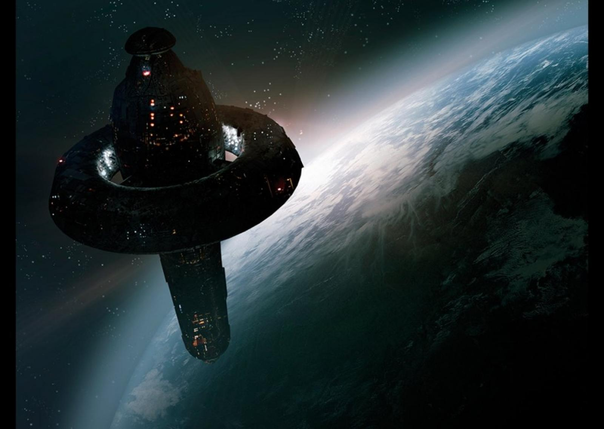
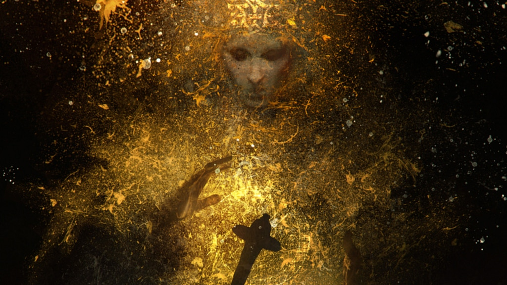
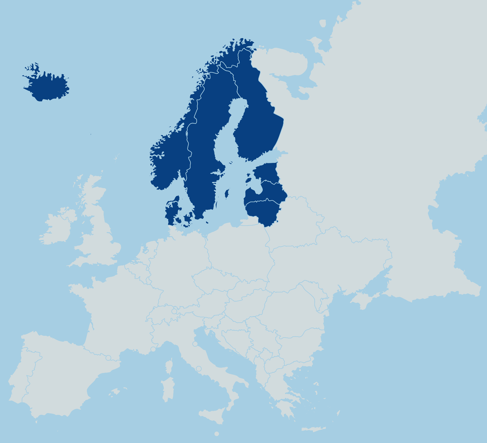
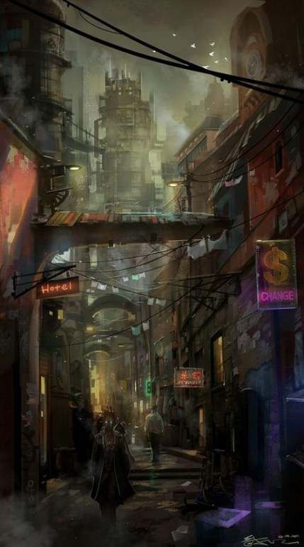
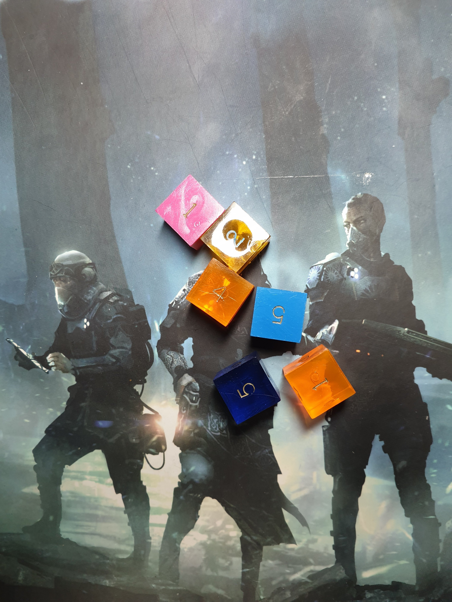
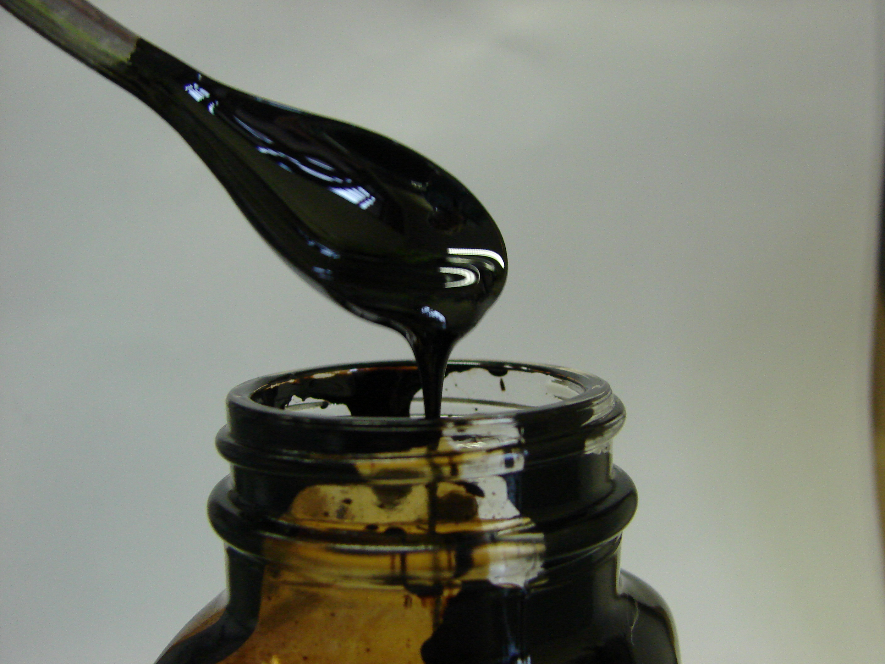
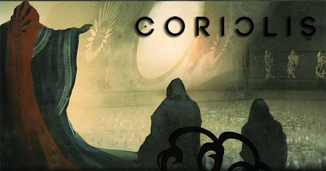

# Coriolis {.title .main}

Czy jest dla mnie?

{.medium-img}

# Trzy składowe {.subtitle}

## Frakcje {.subtitle}

{.height}

## Religia i mistyczne moce {.subtitle}

{.height}

##

{.height}

## Wszechstronność świata {.subtitle}

{.city}

# Mechanika {.subtitle}

{.height}

# Łyżka dziegciu {.subtitle}

{.height}

# Mix & match {.subtitle}

Pomieszaj Larę Croft z "Hyperionem" i "Diuną" oraz posyp "Babylon 5"

# Pytania? {.subtitle}

{.height}

## Dzięki! {.subtitle} 

{.height}
<link href="//db.onlinewebfonts.com/c/c66a8c8c0b5ca45e72dd64fdd13edb49?family=FF+Nexus+Sans" rel="stylesheet" type="text/css"/>
<link href="//db.onlinewebfonts.com/c/49fd27bd9fc2d456041e18185f31c873?family=Foundry+Gridnik" rel="stylesheet" type="text/css"/>
<link rel="stylesheet" type="text/css" href="assets/styles.css">
